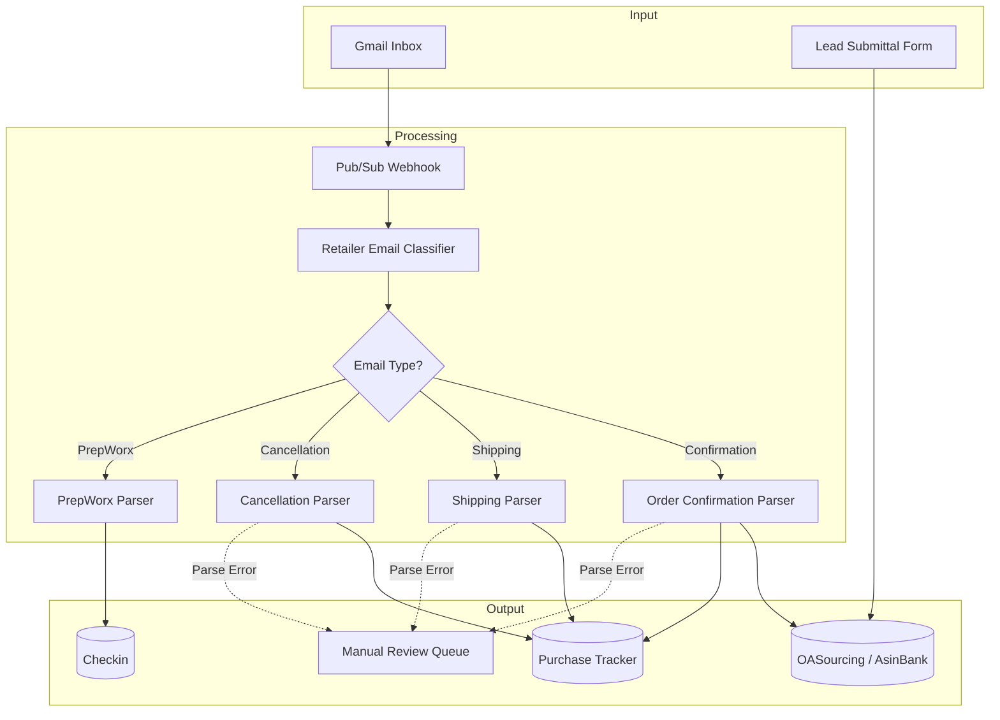
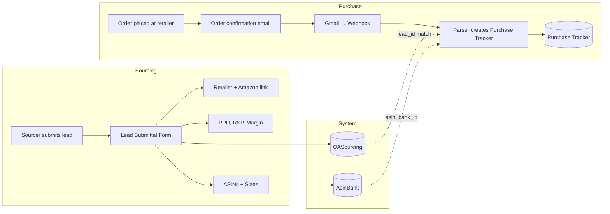
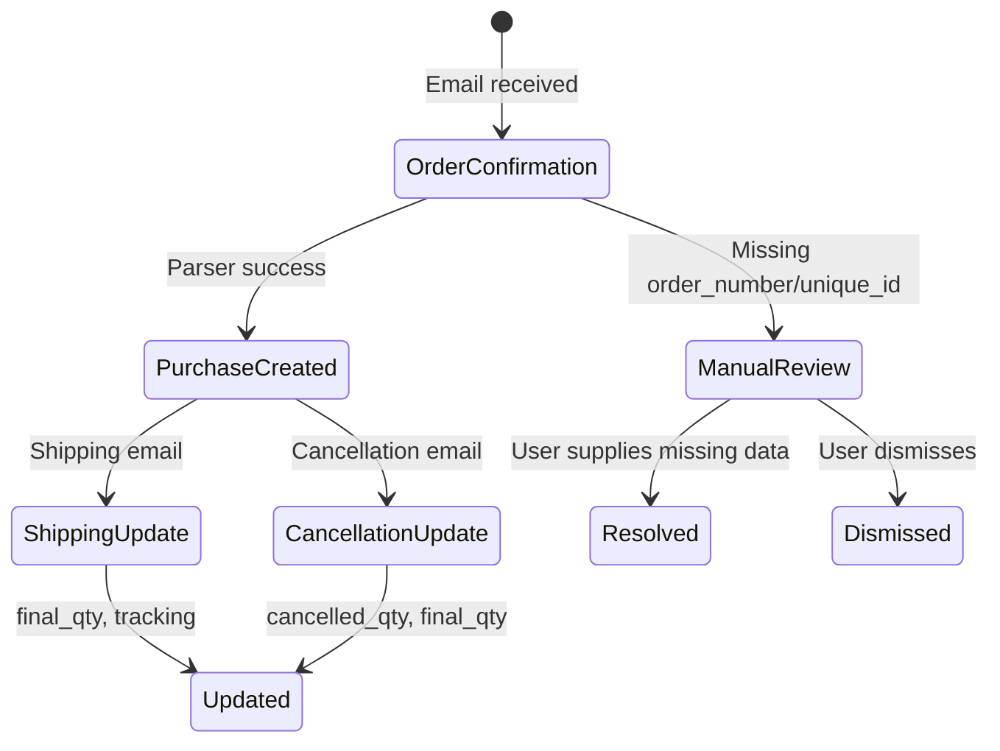
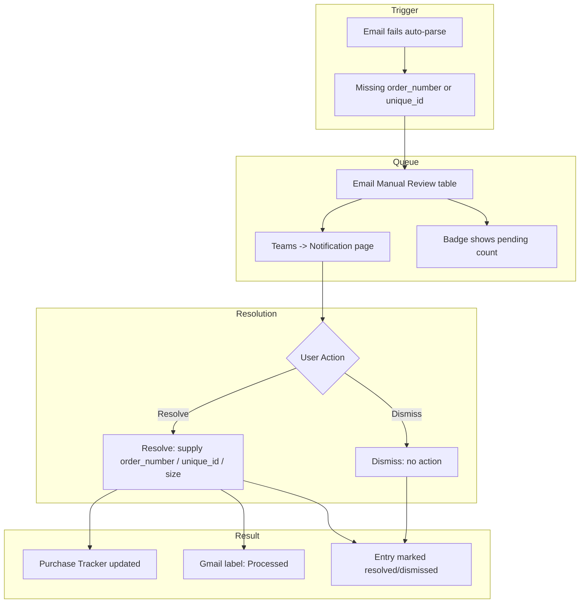
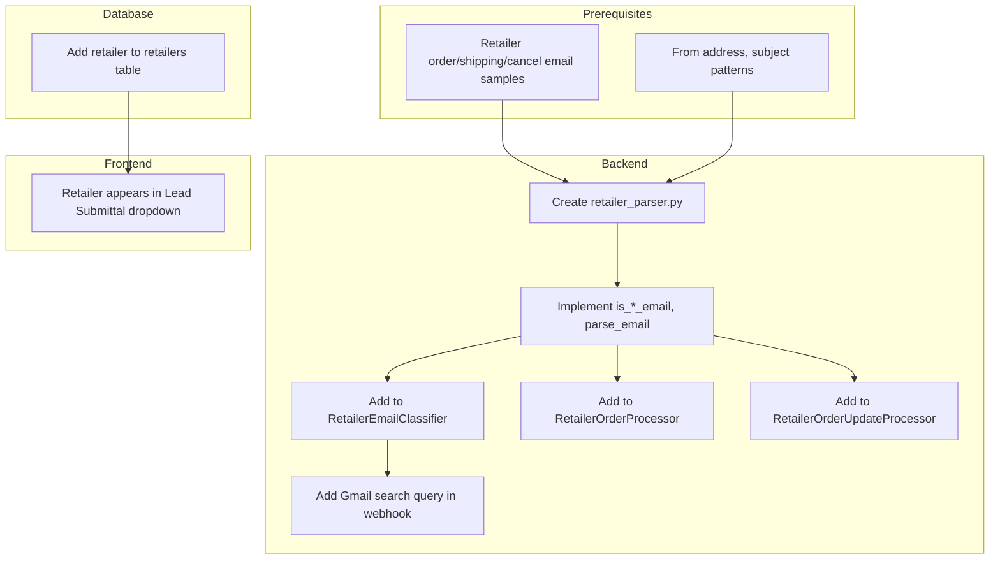

# Purchase Tracker Platform — Team Meeting Presentation
**Date:** February 24, 2025

---

## 1. High Level Overview

### 1.1 How Does This Platform Work?

The **Purchase Tracker** is an OA (Online Arbitrage) sourcing and fulfillment platform that:

1. **Monitors Gmail** — Connected to your Gmail inbox via Google Cloud Pub/Sub for real-time notifications when new emails arrive.

2. **Classifies Retailer Emails** — Automatically detects and classifies emails into:
   - **Order Confirmations** — When you place an order at a retailer
   - **Shipping Notifications** — When items ship (tracking, quantities)
   - **Cancellation Notifications** — When items are cancelled

3. **Extracts Structured Data** — Parses HTML email content to extract:
   - Order numbers, product details (unique_id, size, quantity)
   - Tracking numbers, delivery dates
   - Cancelled quantities

4. **Creates/Updates Records** — Writes to the database:
   - **OASourcing** — Lead data (product, retailer, PPU, RSP, margin, ASINs)
   - **Purchase Tracker** — Individual purchase records (order #, qty, status)
   - **Checkin** — PrepWorx inbound processed items

5. **Integrates with PrepWorx** — Processes "Inbound has been processed" emails from PrepWorx to track warehouse check-ins.

---

### 1.2 Why Are We Using This Platform?

| Benefit | Description |
|--------|-------------|
| **Automation** | Reduces manual data entry from order confirmation → shipping → cancellation |
| **Single Source of Truth** | All purchase data in one place, linked to leads and ASINs |
| **Visibility** | Real-time view of order status, cancellations, and fulfillment pipeline |
| **Scalability** | Handles 25+ retailers with consistent parsing logic |
| **Error Recovery** | Manual review queue for emails that fail auto-parsing |

---

### 1.3 What Is Automated vs. Not Automated?

#### Automated
- Gmail push notifications (new email triggers processing)
- Email classification (retailer + type: confirmation/shipping/cancellation)
- Order confirmation parsing → creates Purchase Tracker records
- Shipping email parsing → updates `final_qty`, `tracking`, `shipped_to_pw`
- Cancellation email parsing → updates `cancelled_qty`, `final_qty`
- PrepWorx inbound emails → creates Checkin records
- Unique ID extraction from retailer URLs (Lead Submittal)
- ASIN Bank reuse across leads

#### Not Automated (Manual)
- **Lead Submittal** — Sourcers submit leads via the Lead Submittal form
- **Manual Review** — Emails that fail parsing (missing order_number or unique_id) go to Teams → Notification
- **Manual Purchase Entry** — Purchases from unsupported retailers or edge cases
- **Process Inbound Creation** — PrepWorx inbound creation (button-triggered)
- **Retailer Addition** — New retailers require backend parser development

---

### 1.4 What Features Do We Use?

| Feature | Location | Purpose |
|---------|----------|---------|
| **Lead Submittal** | Dashboard → Lead Submittal | Submit new product leads with retailer link, Amazon link, PPU, RSP, margin, ASINs |
| **OA Sourcing** | Dashboard → OA Sourcing | View, search, edit leads; manage ASINs; delete leads |
| **ASIN Bank** | Dashboard → ASIN Bank | Central ASIN repository; reused across leads |
| **Retailers** | Dashboard → Retailers | Manage retailer list (used in Lead Submittal dropdown) |
| **Purchase Tracker** | Dashboard → Purchase Tracker | View purchases, edit quantities, add manual purchases, bulk delete |
| **Checkin** | Dashboard → Checkin | View PrepWorx check-in records |
| **Notification** | Teams → Notification | Resolve or dismiss manual review entries (lead errors) |
| **Calendar & PTO** | Teams → Calendar | Team calendar and PTO |
| **Tasks** | Teams → Tasks | Task management |

---

## 2. Workflows (Mermaid Diagrams)

### 2.1 End-to-End Platform Flow

---

### 2.2 Lead Submittal → Purchase Tracker Flow

---

### 2.3 Email Processing (Confirmation → Shipping → Cancellation)

---

### 2.4 Manual Review (Lead Error) Resolution Flow

---

### 2.5 New Retailer Addition (Technical SOP)

---

## 3. SOP for Sourcing Team

### 3.1 Submitting Leads

1. **Navigate:** Dashboard → Lead Submittal  
2. **Required fields:**
   - **Retailer Link** — Full product URL from supported retailer (Foot Locker, Champs, Snipes, ShopWSS, etc.)
   - **Amazon Link** — Amazon product page URL
   - **PPU** (Price Per Unit), **RSP** (Retail Selling Price), **Margin**
   - **ASINs** — At least one ASIN with size and recommended quantity
3. **Optional but recommended:**
   - Product Name, Product SKU
   - Retailer (select from dropdown — must exist in Retailers list)
   - Pros / Cons (multi-select)
   - Other Notes, Promo Code
4. **Unique ID** — Auto-extracted from retailer URL when supported; override if needed.
5. **Submit** — Creates OASourcing record and AsinBank entries. Reuses existing ASINs when possible.

**Supported retailers for Unique ID extraction:** Foot Locker, Champs, Finish Line, JD Sports, Hibbett, Revolve, ASOS, Snipes, DTLR, END Clothing, ShopWSS, Shoe Palace, On, and others.

---

### 3.2 Clearing Lead Errors (Manual Review)

1. **Check Notification badge** — Teams → Notification shows pending count.
2. **Open Notification page** — Lists pending entries (retailer, email type, missing fields).
3. **Click entry** — Opens detail; view extracted data and missing fields.
4. **Resolve:**
   - If **order_number** missing: Enter order number from email.
   - If **unique_id** missing: Enter unique_id and size (or multiple items for ShopWSS/Shoe Palace partial cancels).
   - Click **Resolve** — System applies the cancellation/shipping update and marks processed.
5. **Dismiss** — If entry is irrelevant or duplicate, click **Dismiss**.

**Common scenarios:**
- **Revolve cancellation** — Order number in subject; unique_id/size often missing → supply from email body.
- **ShopWSS partial cancel** — Multiple items; supply unique_id + size per item.
- **Snipes full cancel** — Order number only; items = [] means cancel all.

---

### 3.3 Ensuring Correct Usage of Bot

1. **Use supported retailers** — Only orders from supported retailers auto-create Purchase Tracker records.
2. **Forward emails to monitored inbox** — Ensure order/shipping/cancel emails are sent to the Gmail account connected to the platform.
3. **Don’t remove Gmail labels** — Processed/Error/Manual-Review labels are used to avoid reprocessing.
4. **Check Notification regularly** — Resolve or dismiss manual review entries to keep the queue clear.
5. **Manual purchases** — For unsupported retailers or edge cases, use Purchase Tracker → "Add Manual Purchase" (unique_id, size, qty, order_number).

---

### 3.4 New Retailer SOP (For Sourcing Team)

**Before submitting leads from a new retailer:**

1. **Confirm retailer is in the system** — Check Dashboard → Retailers. If not listed, request addition from dev/admin.
2. **If retailer is not supported for auto-processing:**
   - Leads can still be submitted if the retailer exists in the dropdown.
   - Purchase Tracker records will **not** be auto-created from emails.
   - Use **Manual Purchase** entry in Purchase Tracker for each order.
3. **For full automation** — New retailer requires backend parser development (see technical flow above). Provide sample emails (order confirmation, shipping, cancellation) to the dev team.

---

### 3.5 General Guidelines

| Guideline | Details |
|-----------|---------|
| **Retailer link format** | Use the exact product URL; Unique ID is extracted from it. |
| **Amazon link** | Use the main product page URL for correct ASIN association. |
| **ASINs** | Include size and recommended quantity; system suggests totals. |
| **Duplicate leads** | Avoid submitting the same product/retailer combo twice. |
| **Purchase Tracker edits** | Edit quantities, tracking, status as needed; changes are saved immediately. |
| **Bulk delete** | Use with care; select only records you intend to remove. |

---

## 4. Recommendation

**Format:** Use this Markdown file (`MEETING_PRESENTATION_2-24.md`) as the primary presentation source.

**Why MD:**
- Renders well in VS Code, GitHub, Notion, and most presentation tools.
- Mermaid diagrams render in GitHub, GitLab, Notion, and many MD viewers.
- Easy to edit and version-control.
- Can be exported to PDF or slides (e.g., Marp, Slidev) if needed.

**For the live presentation:**
1. Open the file in a Markdown preview (VS Code, Obsidian, or GitHub).
2. Use the Mermaid diagrams as-is, or export them as images for PowerPoint/Google Slides.
3. Walk through Section 1 (Overview) first, then Section 2 (Workflows), then Section 3 (SOPs).

---

*Generated from Purchase Tracker codebase — February 24, 2025*
