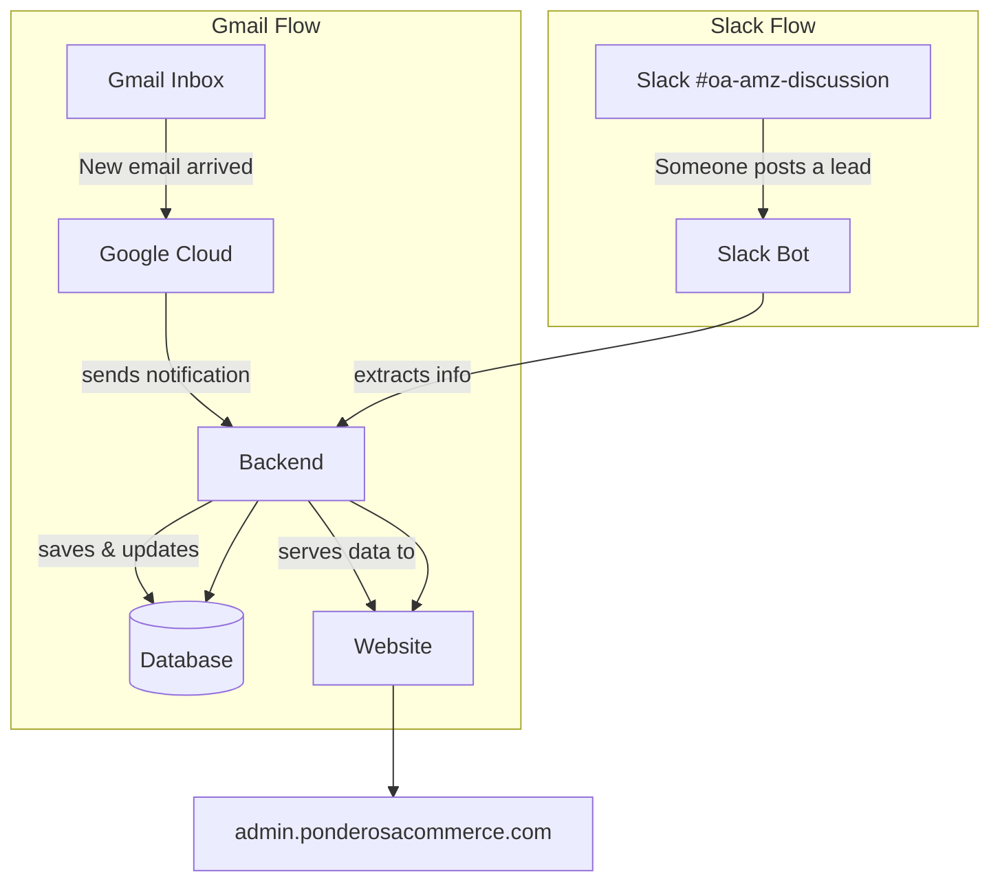

# Purchase Tracker — Software Map & Access Guide

> **For non-technical readers:** This document explains what the Purchase Tracker system is made of, where everything lives, and what access you need. Think of it as a map of your digital tools.

---

## Quick Summary

| What | Where It Lives |
|------|----------------|
| **The app you use** | [admin.ponderosacommerce.com](https://admin.ponderosacommerce.com) |
| **The code** | GitHub (2 repositories) |
| **The data** | Amazon’s cloud (AWS) — database + servers |
| **Email processing** | Google Cloud (Gmail + notifications) |
| **Slack bot** | Runs on a server, talks to Slack |

---

## Part 1: What Does This System Do?

The Purchase Tracker helps you:

1. **Track purchases** — See all your orders from retailers (Foot Locker, Nike, etc.) in one place.
2. **Process emails automatically** — When order confirmations, shipping notices, or cancellations arrive in Gmail, the system reads them and updates your records.
3. **Manage leads** — Submit and track OA sourcing leads from Slack.
4. **Check in inventory** — When PrepWorx processes inbound shipments, the system records it.

---

## Part 2: The Main Pieces (In Plain English)

### The Website (Frontend)

- **What it is:** The screen you see when you log in — dashboards, tables, forms.
- **Where it runs:** Vercel (a hosting service).
- **URL:** [https://admin.ponderosacommerce.com](https://admin.ponderosacommerce.com)

### The Backend (The Brain)

- **What it is:** The part that does the real work — saves data, processes emails, talks to the database.
- **Where it runs:** Amazon Web Services (AWS) — specifically a service called ECS (containers).
- **Region:** Ohio (us-east-2).

### The Database

- **What it is:** Where all your data is stored — orders, leads, users, etc.
- **Where it runs:** AWS RDS (Amazon’s database service).
- **Type:** PostgreSQL (a common database type).

### Gmail + Google Cloud

- **What it does:** Watches your Gmail inbox. When new emails arrive, Google sends a notification to the backend, which then processes them.
- **Project name:** glenallagroup
- **Email used:** glenallagroupc@gmail.com (for dev) and production inboxes

### Slack Bot

- **What it does:** Listens to messages in your Slack channel (#oa-amz-discussion), extracts lead info, and sends it to the backend.
- **Where it runs:** On a server (separate from the main app).

---

## Part 3: Who Owns What?

### Code Repositories (GitHub)

| Repository | Purpose |
|------------|---------|
| **purchase-tracker** | Main app (website + backend) |
| **slack-lead-submittal-bot** | Slack bot that submits leads |

### Cloud Services

| Service | What It Hosts |
|---------|---------------|
| **AWS ECS** | Backend server (https://api.ponderosacommerce.com) |
| **AWS RDS** | PostgreSQL database |
| **Google Cloud** | Gmail integration, notifications |
| **AWS Amplify** | Website Admin Panel (https://admin.ponderosacommerce.com) |
| **AWS Lightsail** | Slack Workspace + bot app |

---

## Part 4: Access Checklist — What You Need

Use this list when onboarding someone new or checking that you have full access.

### 1. GitHub (Code)

- [ ] Access to **purchase-tracker** repository
- [ ] Access to **slack-lead-submittal-bot** repository

### 2. AWS ECS (Amazon Web Services)

- [ ] Login to the AWS account that runs the app
- [ ] Access to **us-east-2** (Ohio) region
- [ ] Ability to view:
  - ECS (where the backend runs)
  - RDS (database)
  - ECR (stored Docker images)

### 3. Google Cloud

- [ ] Access to project **glenallagroup**
- [ ] Gmail API enabled
- [ ] Pub/Sub (notification system) set up

### 4. AWS Amplify

- [ ] Access to the project that hosts **admin.ponderosacommerce.com**
- [ ] Environment variables configured (e.g., API URL)

### 5. Slack

- [ ] Admin access to the Slack workspace
- [ ] Access to the Lead Submittal Bot app settings
- [ ] Bot invited to #oa-amz-discussion

### 6. Dev / Staging Server (Optional)

- [ ] Access to server at **157.173.105.78** (Judah manages this - [contabo.com](https://new.contabo.com/servers/vds))
- [ ] Backend running on port 8000

### 7. DNS Settings
- [ ] Login to Squarespace
  - https://account.squarespace.com/domains/managed/ponderosacommerce.com/dns/dns-settings
  - Here you can see the domain setting for "admin.ponderosacommerce.com" & "api.ponderosacommerce.com"
---

## Part 5: How Data Flows (Simple Diagram)

---

## Part 6: Important Things to Know

### Two Environments

- **Development:** Uses test data, different email (glenallagroupc@gmail.com), dev database.
- **Production:** Uses real data, live Gmail, production database.

---

### Production Email Reference (Order, Shipping, Cancellation)

In **production**, the system looks for emails from specific sender addresses and subject lines. Below is the reference for each retailer you use.

> **Note:** Make sure the Gmail inbox connected to the system receives these emails. If a retailer changes their email format, the system may need to be updated.

---

#### Foot Locker

| Email Type | From (Sender) | Subject Line |
|------------|---------------|--------------|
| **Order confirmation** | `accountservices@em.footlocker.com` | "Thank you for your order" |
| **Shipping update** | `accountservices@em.footlocker.com` | "Your order is ready to go" |
| **Cancellation** | `accountservices@em.footlocker.com` | "An item is no longer available" or "Sorry, your item is out of stock" |

*Kids Foot Locker uses `accountservices@em.kidsfootlocker.com` with the same subject patterns.*

---

#### Champs Sports

| Email Type | From (Sender) | Subject Line |
|------------|---------------|--------------|
| **Order confirmation** | `accountservices@em.champssports.com` | "Thank you for your order" |
| **Shipping update** | `accountservices@em.champssports.com` | "Your order is ready to go" |
| **Cancellation** | `accountservices@em.champssports.com` | "An item is no longer available" |

---

#### Hibbett

| Email Type | From (Sender) | Subject Line |
|------------|---------------|--------------|
| **Order confirmation** | `hibbett@email.hibbett.com` | "Thank you for your order" |
| **Shipping update** | `hibbett@email.hibbett.com` | "Your order has shipped" |
| **Cancellation** | `hibbett@email.hibbett.com` | "Your recent order has been cancelled" or "Your order has been cancelled" |

---

#### Finish Line

| Email Type | From (Sender) | Subject Line |
|------------|---------------|--------------|
| **Order confirmation** | `finishline@notifications.finishline.com` | "Your Order is Official!" |
| **Shipping update** | `finishline@notifications.finishline.com` | "Your order. We've got the scoop on it." |
| **Cancellation** | `finishline@notifications.finishline.com` | "Sorry, but we had to cancel your order." |

---

#### JD Sports

| Email Type | From (Sender) | Subject Line |
|------------|---------------|--------------|
| **Order confirmation** | `jdsports@notifications.jdsports.com` | "Thank you for your order" |
| **Shipping update** | `jdsports@notifications.jdsports.com` | "Your order. We've got the scoop on it." |
| **Cancellation** | `jdsports@notifications.jdsports.com` | "Sorry, but we had to cancel your order." |

---

#### Revolve

| Email Type | From (Sender) | Subject Line |
|------------|---------------|--------------|
| **Order confirmation** | `revolve@mt.revolve.com` | "Your order #... has been processed" |
| **Shipping update** | `revolve@mt.revolve.com` | "Your order #... has been shipped" or "Part of Order #... has shipped" |
| **Cancellation (Type 1)** | `revolve@mt.revolve.com` | "An item from your order was cancelled" |
| **Cancellation (Type 2)** | `sales@t.revolve.com` | "An item in your order is out of stock" |

---

#### ASOS

| Email Type | From (Sender) | Subject Line |
|------------|---------------|--------------|
| **Order confirmation** | `orders@asos.com` | "Thanks for your order!" |
| **Shipping update** | `orders@asos.com` | "Your order's on its way!" |
| **Cancellation** | *Not supported* | — |

---

#### Snipes

| Email Type | From (Sender) | Subject Line |
|------------|---------------|--------------|
| **Order confirmation** | `no-reply@snipesusa.com` | "Confirmation of Your SNIPES Order" |
| **Shipping update** | `info@t.snipesusa.com` | "Get Hyped! Your Order Has Shipped" |
| **Cancellation (partial)** | `info@t.snipesusa.com` | "Cancelation Update" or "Cancellation Update" |
| **Cancellation (full)** | `info@t.snipesusa.com` | "Update on Your SNIPES Order" |

---

#### DTLR

| Email Type | From (Sender) | Subject Line |
|------------|---------------|--------------|
| **Order confirmation** | `custserv@dtlr.com` | "Order #... confirmed" |
| **Shipping update** | `custserv@dtlr.com` | "Order ... Has Been Fulfilled" |
| **Cancellation** | `custserv@dtlr.com` | "There has been a change to your order" |

---

#### Shoe Palace

| Email Type | From (Sender) | Subject Line |
|------------|---------------|--------------|
| **Order confirmation** | `store+8523376@t.shopifyemail.com` | Contains "confirmed" |
| **Shipping update** | `store+8523376@t.shopifyemail.com` | "A shipment from order #SP... is on the way" |
| **Cancellation** | `customerservice@shoepalace.com` | "Order Cancelation Notification" or "Items cancelled for Order" |

---

#### END Clothing

| Email Type | From (Sender) | Subject Line |
|------------|---------------|--------------|
| **Order confirmation** | `info@orders.endclothing.com` | "Your END. order confirmation" |
| **Shipping update** | `info@orders.endclothing.com` | "Your END. order has shipped" |
| **Cancellation** | *Not supported* | — |

---

#### ShopWSS

| Email Type | From (Sender) | Subject Line |
|------------|---------------|--------------|
| **Order confirmation** | `help@shopwss.com` | "Order #... was received!" |
| **Shipping update** | `help@shopwss.com` | "Order #... is about to ship" or "partially shipped" |
| **Cancellation (full)** | `help@shopwss.com` | "Order #... has been canceled" |
| **Cancellation (partial)** | `noreply@shopwss.com` | "Cancelled Order Notification" |

---

#### On (On Running)

| Email Type | From (Sender) | Subject Line |
|------------|---------------|--------------|
| **Order confirmation** | `no-reply@on.com` | "Thanks for your order" |
| **Shipping update** | *Not supported* | — |
| **Cancellation** | *Not supported* | — |

---

### Secrets & Passwords

Sensitive data (Gmail tokens, database passwords) is stored in:
- **Development:** Local `.env` files (never shared or committed to code).
- **Production:** AWS Secrets Manager (secure cloud storage) -> AWS S3 Buckets.

---

## Part 7: Who to Ask for What

| Need | Who to Contact |
|------|----------------|
| Can’t log in to the website | Developer / IT |
| Emails not being processed | Developer (check Gmail watch, Pub/Sub) |
| Slack bot not responding | Developer (check bot server, Slack app) |
| Need database access | Developer / AWS admin |
| Need GitHub access | Repository owner / org admin |
| Need AWS/Google Cloud access | Account owner / cloud admin |

---

## Part 8: File Reference (For Your Developer)

| File or Folder | Purpose |
|----------------|---------|
| `backend/.env` | Production configuration (not in code repo) |
| `backend/.env.development` | Development configuration |
| `frontend/.env` | Frontend configuration (API URL, etc.) |
| `slack-lead-submittal-bot/.env` | Slack bot configuration |
| `backend/migrations/` | Database change scripts |
| `backend/deploy.sh` | Deploy backend to AWS |
| `backend/secrets.sh` | Manage passwords in AWS |

---
